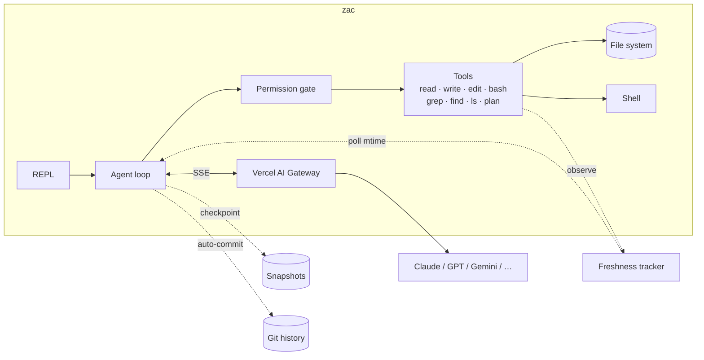
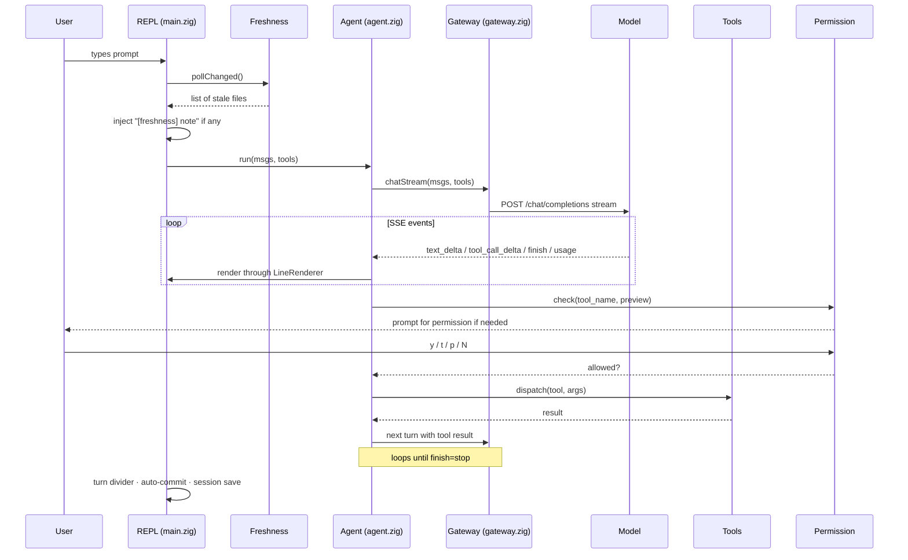
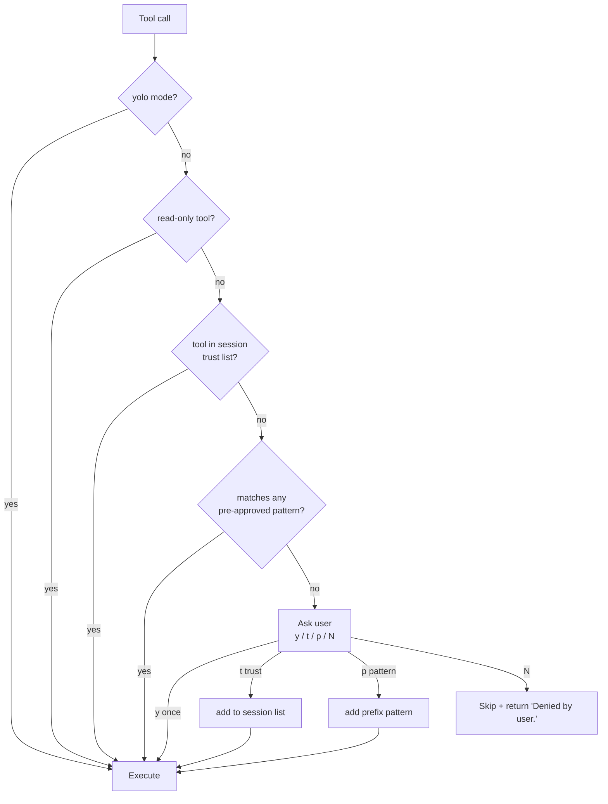

<div align="center">

# zac

**A coding agent that lives in your terminal.**

[](https://ziglang.org)
[](#install)
[](#architecture)
[](#test-plan)
[](#license)

</div>

---

zac talks to the [Vercel AI Gateway](https://vercel.com/docs/ai-gateway) directly — one HTTPS endpoint, one streaming protocol, no SDK between you and the model. It runs **inline** (no alt-screen takeover), pipes cleanly, gets out of your way.

```
~3,800 LoC of Zig                · 28 unit tests passing
8 tools · 11 prompt modes        · 6 MB debug / ~1–2 MB release
0 runtime dependencies           · single static binary
```

> **Not** trying to be Cursor or Claude Code. Trying to be the smallest agent you can actually live inside.

---

## Table of contents

<table>
<tr>
<td>

**Getting in**
- [Quickstart](#quickstart)
- [Configure](#configure)
- [Things to try](#things-to-try)

</td>
<td>

**Reference**
- [Tools](#tools)
- [Modes](#modes)
- [Slash commands](#slash-commands)
- [CLI flags](#cli-flags)

</td>
<td>

**Under the hood**
- [Architecture](#architecture)
- [What makes zac different](#what-makes-zac-different)
- [Test plan](#test-plan)
- [Roadmap](#roadmap)

</td>
</tr>
</table>

---

## What makes zac different

Most agents are reimplementations of the same architecture. zac is the same idea (multi-turn streaming tool loop) with **five things you won't find elsewhere**:



| Feature | What it does |
|---|---|
| **Stale-context auto-refresh** | Tracks the mtime of every file the agent reads. Before each turn, files changed on disk are flagged so the model re-reads them. No more "the agent edited a version of the file that's already obsolete." |
| **Diff-aware re-reads** | When the agent re-reads a file already in context, only the diff since last read is returned. Saves a lot of tokens on big files. |
| **Cost projection** | Each prompt shows an estimated input cost *before* you hit enter, based on conversation size and the model's pricing. No surprise $5 turns. |
| **Snapshots** | `/snapshot <name>` checkpoints both the conversation AND every file the agent touched. `/restore <name>` rolls back both. Conversational undo. |
| **Per-turn git commits** | When zac touches files in a git repo, each turn becomes a real commit. `/undo` does a soft reset. Real version control over the agent. |

---

## Quickstart

<details open>
<summary><b>Install</b> (Zig 0.14.x required)</summary>

```bash
git clone https://github.com/YuktiKholiwal/zac.git
cd zac
zig build -Doptimize=ReleaseSmall
./zig-out/bin/zac --help
```

<details>
<summary>Don't have Zig 0.14.x?</summary>

zac doesn't build on Zig 0.15+ yet (stdlib churn). Get a 0.14.x toolchain:

```bash
# macOS Apple Silicon
curl -LO https://ziglang.org/download/0.14.1/zig-aarch64-macos-0.14.1.tar.xz
tar xf zig-aarch64-macos-0.14.1.tar.xz
mv zig-aarch64-macos-0.14.1 ~/zig-0.14.1
export PATH="$HOME/zig-0.14.1:$PATH"   # add to ~/.zshrc to persist
zig version    # should print 0.14.1
```

Replace `aarch64-macos` with `x86_64-macos` / `x86_64-linux` / `aarch64-linux` as needed.

</details>

</details>

<details open>
<summary><b>Configure</b></summary>

You need a [Vercel AI Gateway](https://vercel.com/ai-gateway) API key. Two ways to set it:

```bash
# Option A — .env file (gitignored)
cp .env.example .env
# edit .env, paste your vck_... key

# Option B — shell env vars (override .env)
export AI_GATEWAY_API_KEY="vck_..."
export AI_GATEWAY_MODEL="anthropic/claude-sonnet-4-5"   # optional
```

Defaults: model is `anthropic/claude-sonnet-4-5`, base URL is `https://ai-gateway.vercel.sh/v1`.

</details>

<details open>
<summary><b>Run it</b></summary>

```bash
./zig-out/bin/zac                              # interactive REPL
./zig-out/bin/zac "explain this codebase"      # bare-arg one-shot
./zig-out/bin/zac -c                           # continue last session
./zig-out/bin/zac -m plan                      # start in plan mode
```

</details>

---

## Things to try

A guided tour through what zac does well. Expand each.

<details>
<summary><b>Exploration</b> — understanding code you didn't write</summary>

```
> what does this project do? read README.md and the entry point
> list every Zig file under src/tools and tell me what each does in one line
> find every place that uses ArrayListUnmanaged and explain why
> walk me through how a single user prompt flows from main.zig to the gateway
```

</details>

<details>
<summary><b>Building</b> — adding features</summary>

```
> add a --max-tokens flag that overrides cfg.max_tokens
> add a /clear-session slash command that deletes ~/.zac/last_session.json
> add a write_file_if_missing tool that only writes if the file doesn't exist
```

</details>

<details>
<summary><b>Debugging</b> — finding what's wrong</summary>

```
> /mode debug
> running `zig build test` fails with [paste the error]; track it down
```

</details>

<details>
<summary><b>Reviewing</b> — pre-PR sanity check</summary>

```
> /mode review
> review the recent changes in src/tools/edit.zig for correctness and edge cases
> /mode review-security
> look at src/tools/bash.zig — what's the worst a model could do with it?
```

</details>

<details>
<summary><b>Quick questions</b> — one-shot from shell</summary>

```bash
./zig-out/bin/zac "summarize the last 5 commits"
./zig-out/bin/zac "what's the LoC of this project?"
./zig-out/bin/zac "explain what sse.zig does in 3 sentences" -m ask
```

</details>

<details>
<summary><b>Heavy work</b> — multi-step agentic tasks</summary>

```
> Plan it, then implement, then verify:
> add a --temperature flag wired through to the gateway request body,
> with a unit test, and run zig build test at the end.
```

zac uses the `plan` tool to track steps and check them off as it goes.

</details>

<details>
<summary><b>Operational</b> — snapshots, undo, compaction</summary>

```
> /snapshot before_risky
> [do something experimental]
> /restore before_risky        # roll back conversation + files
> /undo                        # undo last auto-commit (working tree preserved)
> /usage                       # cumulative tokens
> /squash                      # manually compact long conversation
```

</details>

---

## Tools

The agent has eight. Read-only ones (`read`, `grep`, `find`, `ls`, `plan`) auto-allow. The three mutating ones prompt with `[y]es / [t]rust tool / [p]attern '...' / [N]o`.

<details>
<summary><b><code>read</code></b> — fetch file contents</summary>

Returns the file with 1-indexed line numbers. Pages with `offset`/`limit` on big files. **Diff-aware**: if the file was already read this session and has changed, only the diff is returned.

```json
{ "path": "src/main.zig", "offset": 100, "limit": 50 }
```

</details>

<details>
<summary><b><code>write</code></b> — create or overwrite</summary>

Refuses paths outside cwd unless `--allow-outside`. Creates missing parent directories.

```json
{ "path": "src/new_module.zig", "content": "const std = @import(\"std\");\n..." }
```

</details>

<details>
<summary><b><code>edit</code></b> — substitute exact text</summary>

Tries exact match first. If that fails, falls back to a **whitespace-tolerant** match (collapses runs of whitespace in both the file and the search text). On miss, suggests nearby lines by substring.

```json
{
  "path": "src/main.zig",
  "old_text": "const DEFAULT_MODEL = \"anthropic/claude-sonnet-4-5\";",
  "new_text": "const DEFAULT_MODEL = \"openai/gpt-4o\";"
}
```

</details>

<details>
<summary><b><code>bash</code></b> — run a shell command</summary>

Wrapped in `sandbox-exec` on macOS by default (blocks writes to `/etc`, `/usr`, `/System`, `/Library`, `/private/etc`, `/bin`, `/sbin`, `/Applications`). Disable with `--no-sandbox`.

```json
{ "command": "zig build test --summary all", "timeout": 60 }
```

</details>

<details>
<summary><b><code>grep</code></b> — substring search</summary>

`.gitignore`-aware. Caps at 200 hits. `include` is a suffix filter (e.g. `.zig`).

```json
{ "pattern": "ArrayListUnmanaged", "path": "src", "include": ".zig" }
```

</details>

<details>
<summary><b><code>find</code></b> — glob file discovery</summary>

Supports `*` (within segment), `**` (across segments), `?` (single char). `.gitignore`-aware.

```json
{ "pattern": "src/**/*.zig", "path": "." }
```

</details>

<details>
<summary><b><code>ls</code></b> — list a directory</summary>

Non-recursive. Shows type tag (`f` file, `d` dir, `l` symlink) and byte size of files.

```json
{ "path": "src/tools" }
```

</details>

<details>
<summary><b><code>plan</code></b> — visible task checklist</summary>

The model emits a full plan; zac formats it. Replaces the prior plan each call.

```json
{
  "todos": [
    { "content": "Read src/main.zig", "status": "completed" },
    { "content": "Add --temperature arg", "status": "in_progress" },
    { "content": "Wire into gateway request body", "status": "pending" }
  ]
}
```

</details>

---

## Modes

Pick at launch (`-m <name>`) or switch mid-session (`/mode <name>`). The mode swaps the system prompt; conversation continues.

| Mode | When to use | Color |
|---|---|---|
| `default` | Generic baseline | dim |
| `code` (default) | Writing real code with TDD-style verify-after-each-edit | 🟢 green |
| `plan` | Map out an approach without writing code | 🔵 blue |
| `ask` | Q&A; minimal tool spam | 🔵 cyan |
| `review` | Look at code, don't change it; surface bugs/edge cases | 🟡 yellow |
| `debug` | Hypothesis-driven root-cause hunting | 🟣 magenta |
| `simplify` | Reduce code without changing behavior |  |
| `brainstorm` | Generate distinct options before committing |  |
| `write-prompt` | Help author LLM system prompts |  |
| `frontend-design` | UI/UX-aware coding; a11y by default |  |
| `review-security` | Threat-model first, then look for vulns |  |

---

## Slash commands

| Command | Effect |
|---|---|
| `/help` | Show in-REPL help |
| `/mode <name>` | Switch system prompt mode |
| `/model <name>` | Swap model (e.g. `openai/gpt-4o`) |
| `/reasoning on\|off` | Toggle visible reasoning stream |
| `/usage` | Cumulative tokens (in / out / total) |
| `/squash` | Manually compact conversation history |
| `/snapshot <name>` | Save conversation + tracked files under `~/.zac/snapshots/` |
| `/restore <name>` | Roll back conversation and files to a snapshot |
| `/snapshots` | List saved snapshots |
| `/undo` | `git reset --soft HEAD~1` on the last auto-commit |
| `/reset` | Clear conversation history |
| `/exit`, `/quit` | Quit (Ctrl-D also works) |

---

## CLI flags

| Flag | Effect |
|---|---|
| `<bare prompt>` | One-shot; runs once and exits |
| `-p, --prompt "..."` | Same as bare-prompt, explicit |
| `-c, --continue` | Load previous session |
| `-m, --mode <name>` | Start in a specific prompt mode |
| `--yolo` | Auto-allow every tool call (skip permission prompts) |
| `--allow-outside` | Permit `write`/`edit` to paths outside cwd |
| `--no-sandbox` | Disable macOS `sandbox-exec` wrap around `bash` |
| `--no-color` | Plain output (also auto-off when piped) |
| `--no-auto-commit` | Skip per-turn git commits |
| `-h, --help` | Print usage |

---

## Project context auto-loading

On startup, zac looks for the first of these in cwd and appends it to the system prompt:

```
AGENTS.md  →  CLAUDE.md  →  .zac/AGENTS.md  →  .cursor/rules
```

Drop your project conventions in any of them and zac picks them up automatically each session.

---

## Architecture

<details open>
<summary><b>File tree</b></summary>

```
src/
├── main.zig          REPL, argv parsing, slash commands, session lifecycle
├── agent.zig         multi-turn streaming loop, tool-call accumulation
├── gateway.zig       HTTPS request builder, 1× retry on 5xx
├── sse.zig           Server-Sent Events parser → typed events
├── messages.zig      OpenAI chat-completions JSON shapes
├── ui.zig            inline ANSI renderer (markdown, tool icons, hyperlinks)
├── permission.zig    yolo / once / trust / pattern allowlists
├── session.zig       save/load to ~/.zac/last_session.json
├── compaction.zig    auto-summarise history at 100k prompt tokens
├── context.zig       AGENTS.md / CLAUDE.md auto-loader
├── env.zig           .env file loader
├── gitignore.zig     small .gitignore matcher for grep + find
├── cancel.zig        SIGINT handler for cancelling in-flight turns
├── path_guard.zig    refuse writes outside cwd unless --allow-outside
├── sandbox.zig       macOS sandbox-exec wrapper for `bash`
├── freshness.zig     mtime tracking + diff-aware re-read storage
├── pricing.zig       per-model rough cost estimation
├── snapshot.zig      conversation + tracked-files checkpoints
├── autogit.zig       per-turn git commits + /undo
├── prompt.zig        11 embedded prompt modes (via @embedFile)
├── prompts/*.md      the mode files themselves
└── tools/
    ├── mod.zig       tool registry + dispatch + shared module state
    ├── read.zig
    ├── write.zig
    ├── edit.zig
    ├── bash.zig
    ├── grep.zig
    ├── find_files.zig
    ├── list_dir.zig
    └── todo.zig
```

</details>

<details>
<summary><b>How a turn flows</b></summary>



</details>

<details>
<summary><b>How permission decisions resolve</b></summary>



</details>

---

## Build from source

```bash
zig build                              # debug build
zig build -Doptimize=ReleaseSmall      # ~1–2 MB release
zig build test --summary all           # 28 unit tests
zig build run -- --help                # build + run with args
```

---

## Test plan

Quick smoke after any change:

```bash
zig build test --summary all                # 28/28
zig build && ./zig-out/bin/zac --help      # banner + help renders
echo "/exit" | ./zig-out/bin/zac           # plain output when piped
```

For end-to-end checks of all features, see the test walkthrough in the project history.

---

## Roadmap

What zac deliberately **does not** do (and probably won't):

- **No TUI.** No alt-screen, no mouse, no scrollback widget. Your terminal already handles those.
- **No MCP/ACP.** Out of scope until the protocols settle and a real need shows up.
- **No multi-provider abstraction.** The Vercel AI Gateway is the abstraction.
- **No syntax highlighting.** Models output unstyled code; rendering it costs more than it returns.

Possible future additions (if real use surfaces a need):

- `/replay <turn> --with <model>` — re-run a turn with a different model for comparison
- `/branch <name>` — fork the conversation, switch between branches
- Permission learning — auto-suggest patterns the user always approves
- Conversation diary — long-term `~/.zac/diary/` summaries

---

## Credits

Design loosely inspired by [zerostack](https://github.com/gi-dellav/zerostack) (GPL-3.0). zac is an independent reimplementation in Zig with a different architecture (no `rig`, no `crossterm`, no alt-screen) and different feature set (`.env`, stale-context refresh, diff-aware re-reads, snapshots, per-turn git commits).

## License

<a id="license"></a>

To be decided. Until a `LICENSE` file lands, treat the source as "available for personal use, not yet relicensable."
